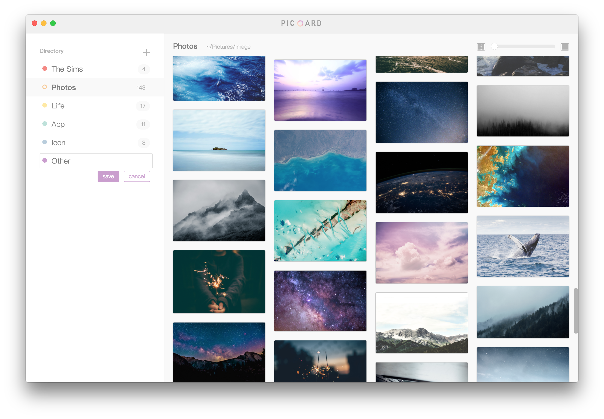

# [Picoard](http://picoard.sorumi.me/)

#### An elegant way to organize your inspiration.

 

## Features

- Connect to your local directories. Convenient for management.
- Marvelous **waterfall layout**. Easy to scale.
- Various image formats supported, includes PNG, JPG, GIF, SVG.
- **Drag and drop** to easy add directories. **Shortcuts** to fast copy and paste images.
- Simple and smooth interface. 

## Usage

- Press <kbd>Command+N</kbd> or just drag to add a local directory.
- Use <kbd>↑</kbd> and <kbd>↓</kbd> to browse directories and images quickly.
- Double click image to inspect and zoom.
- Use <kbd>Command+C</kbd> to copy, <kbd>Command+V</kbd> to paste, <kbd>Command+A</kbd> to select all, <kbd>Command+Delete</kbd> to delete.

## Downloads

- macOS: [click here to download]()

## Thanks

Picoard based on [Electron](https://electron.atom.io/) and [React](https://facebook.github.io/react/), powered by [electron-react-boilerplate](https://github.com/chentsulin/electron-react-boilerplate).

- [Ant Design](https://ant.design/index-cn)
- [NodObjc](https://github.com/TooTallNate/NodObjC)
- [electron-store](https://github.com/sindresorhus/electron-store)
- [react-draggable](https://github.com/mzabriskie/react-draggable)
- [react-sortable-hoc](https://github.com/clauderic/react-sortable-hoc)

## License

MIT

Crafted with ❤ by [Sorumi](http://sorumi.me/)
